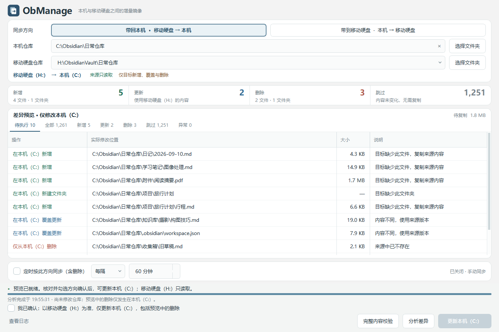

# ObManage

**一个窗口，安全管理 Windows 上的一组 Obsidian 仓库。**

ObManage 2 不再只是仓库镜像工具。它把常用的仓库统计、配置与模板分发、回收站清理统一成六个独立页面；每个可能写入仓库的功能都先预览实际路径，再由用户明确选择和确认。

整个过程在本地完成，无须云账号。业务引擎独立于界面，设置、部署事务记录和日志保存在本机应用数据目录，与仓库分离。



*截图使用隔离的演示数据，不包含真实仓库内容。*

## 六个页面

| 页面 | 用途 | 是否写入仓库 |
| --- | --- | --- |
| 仓库镜像 | 在本机与移动硬盘之间做单向增量镜像 | 仅写入本轮目标 |
| 仓库统计 | 统计仓库、Markdown、UTF-8 字符和文件大小 | 否，全程只读 |
| 模板套件部署 | 将选中的 `.claude`、`.claudian`、`.obsidian`、`File` 组件部署到明确勾选的仓库 | 仅写入所选目标的限定子树 |
| Obsidian 配置分发 | 将一个 `.obsidian` 完整分发到多个仓库 | 仅写入所选目标的 `.obsidian` |
| Templater 分发 | 将 `File/Templater` 完整分发到多个仓库 | 仅写入所选目标的 `File/Templater` |
| 回收站清理 | 预览并直接清理仓库根目录下的 `.trash` | 仅移除扫描后选中且已预览的内容 |

左侧导航固定把“仓库镜像”放在第一页。所有页面共享一个后台任务槽：镜像、统计、部署或清理不会在同一进程中重叠运行；若镜像定时任务到点时其他任务正忙，本轮会跳过，不累计补跑。只要还有部署事务或升级前遗留的回收站隔离批次等待处理，左侧会显示“待恢复事务”，并暂停所有新的写操作和定时镜像。

## 安全模型

### 镜像

每次只选择一个方向，以来源为准同步新增、修改和删除。来源只读取，所有变化只发生在目标；目标独有文件也属于删除范围，因此它不是双向合并工具。

普通文件先暂存到目标盘，校验后替换；新增或更新失败、取消后不会继续删除。程序拒绝源目标相同、互相包含、目标为盘根、链接或重解析点越界，并在执行前复核路径、磁盘身份和预览是否仍有效。空来源可能清空目标时必须额外手动确认。

### 配置与模板部署

三个分发页面共用同一套事务引擎，但来源、组件和目标必须在各自页面明确选择：

1. 分析阶段逐文件计算 SHA-256，列出文件与目录的 `新增 / 更新 / 删除 / 跳过`，不创建事务记录，也不写目标。
2. 执行前重新验证来源、目标、父目录和磁盘身份；任一项变化都会拒绝旧预览。
3. 所有目标先在各自目标卷完成完整暂存和校验，任何一个目标预备失败都不会提交其他目标。
4. 提交通过目录重命名快速切换，旧版本以 UUID 事务备份保留；中途失败会停止后续目标并逆序回滚。
5. 持久事务记录允许应用重启后继续“撤销部署”或“确认保留”。确认保留后才清理已验证的旧版本。

分发采用完整子树语义：所选目标子树最终与来源一致，预览中的文件和目录删除会真实发生。执行前还会读取 Obsidian 当前打开仓库状态：已打开的目标会被阻止；无法可靠读取状态时，必须额外确认已关闭所有所选目标。不要手动改动页面提示的待处理事务目录；内容或身份不匹配时，程序会拒绝删除或回滚。

### 回收站清理

清理功能只识别真实 Obsidian 仓库根目录的 `.trash`，不会递归删除业务目录中同名的文件夹。扫描会完整列出文件、目录和大小，并默认选中全部非空回收站；可以在确认前取消任意仓库。

勾选“直接删除且无法恢复”的确认后，程序会先完整复核所有所选预览，再按预览逐项删除并保留 `.trash` 目录。新清理不会复制隔离备份，也不会创建回收站 journal 或认证密钥；删除不可撤销。执行期间新出现的项目不属于原预览，不会被顺带删除；权限错误、取消或并发变化可能留下部分清理结果，页面会显示已删除数量并要求重新扫描。

若升级前已经存在 2.0.0 隔离批次，页面只在检测到这些旧数据时显示兼容恢复区；旧批次仍可恢复或确认永久清理，处理完成前继续参与全局恢复门禁。程序不会借本次清理授权自动删除旧备份。

## 开始使用

### 已有便携程序

解压 `dist\ObManage.zip` 后，压缩包根目录就是程序根目录，直接打开其中的 `ObManage.exe`。保留旁边的 `_internal` 文件夹，移动时复制解压后的整个目录；运行便携版无须安装 Python。

仓库镜像的基本流程：

1. 选择本机仓库、移动硬盘仓库和“带走 / 带回”方向。
2. 点击“分析差异”，核对实际修改位置，尤其是删除项。
3. 勾选本轮方向确认，再更新目标。

其他管理页面的基本流程：选择仓库集合根目录和来源，扫描或分析，核对目标、文件与目录预览及删除数量，再执行。分发目标默认不选；回收站扫描后默认选择全部非空项。输入、选择或页面上下文变化后，旧确认都会失效。

详细说明见 [使用指南](docs/使用指南.md)。

### 从源码运行或打包

环境：**Windows x64、Python 3.14（普通 GIL 版本）**。界面使用 PySide6，镜像基线使用 SQLite。依赖版本固定在 requirements 文件中。

```powershell
git clone https://github.com/DewMysimple/ObManage.git
cd ObManage
python -m venv .venv
.\.venv\Scripts\python.exe -m pip install -r requirements-dev.txt
.\.venv\Scripts\python.exe -m obmanage
```

生成便携程序：

```powershell
.\.venv\Scripts\python.exe tools\build.py
```

产物位于 `dist\ObManage\`，并自动生成 `dist\ObManage.zip`。ZIP 解压后直接得到程序根目录，不会再套一层 `ObManage` 文件夹；Git 源码仓库不跟踪构建产物，下载源码后需执行上述构建步骤才能得到 EXE 和 ZIP。

命令行 `--preview --source ... --target ...` 仍只提供“仓库镜像”的只读差异 JSON；其余功能在桌面界面中使用。

## 镜像的增量校验

首次遇到已有副本时，同路径、同大小文件会做 SHA-256 内容比较：内容相同就跳过复制并记录两端状态。后续分析可用每端大小与精确修改时间快速判断；任一边发生变化才重新比较。

“完整内容校验”会绕过快速记录，重新读取两端每个文件并做 SHA-256。本机与移动盘位于不同卷时，两端会并行读取；它仍是完整校验，不是抽样。第一版按整个文件增量处理，视频内容变化时会复制整个视频。

## 数据与日志位置

设置、SQLite 镜像基线、部署事务和日志位于 `%LOCALAPPDATA%\ObManage`，并且必须与所有仓库和来源分离。直接清理只会额外使用一个跨进程锁，不生成新的回收站隔离备份、journal 或密钥；升级前已有隔离数据仍保留在此目录等待用户处理。即使自定义 `--state-dir` 指进仓库，程序也会在创建日志、锁或设置前拒绝。镜像的同卷临时文件、部署的同卷事务目录只在安全提交或待确认恢复期间存在；`.obmanage-deploy-*` 是保留恢复命名空间，不会进入仓库发现、统计或镜像。日志可从界面的“查看操作日志”打开。

部署事务及升级前遗留隔离记录使用独立本机密钥校验完整性并绑定恢复目录身份，用于拒绝单个记录损坏、路径漂移和孤立替换。它不是操作系统权限隔离：已经能任意读写应用状态目录和仓库的同账户程序，也能直接破坏这些数据；操作期间应关闭其他会修改目标的工具。

镜像与部署处理普通文件和目录，不复制 NTFS 权限、备用数据流，也不提供通用历史版本系统。目录链接、符号链接、其他重解析点、特殊文件和仅大小写不同的歧义路径会被拒绝。

## 开发与工程记忆

```powershell
.\.venv\Scripts\python.exe -m pytest -q
.\.venv\Scripts\python.exe wiki_memory\工具\memory_lint.py check
```

测试全部使用隔离临时目录，覆盖双向镜像、来源保护、陈旧预览、部署事务恢复、回收站直接删除与遗留批次兼容、只读文件、链接边界、全局任务互斥和多尺寸界面。真实仓库的开发验收只做只读预览。

- [工程记忆](wiki_memory/README.md)
- [Agent 工程约定](AGENTS.md)
- [第三方组件说明](THIRD_PARTY_NOTICES.md)
